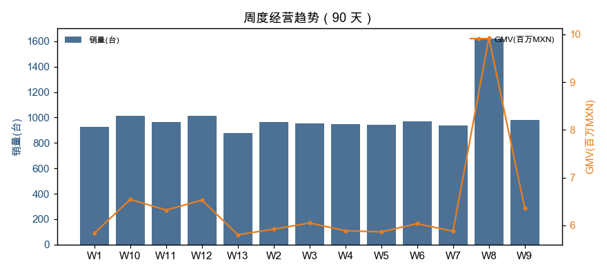
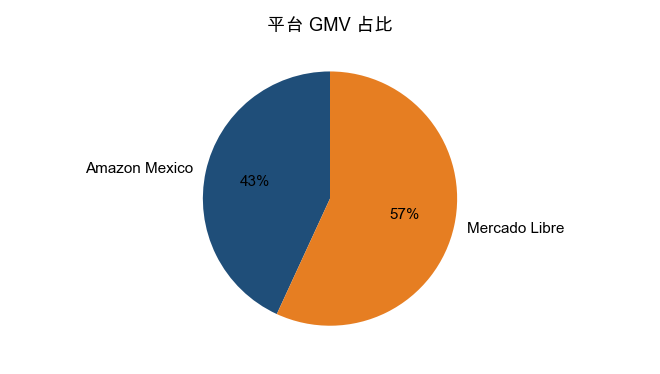
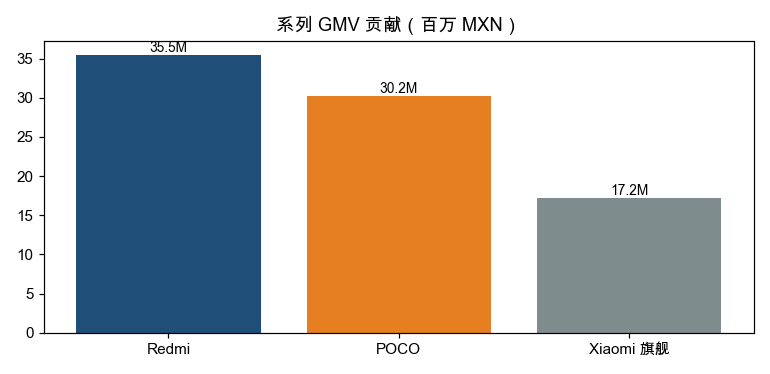
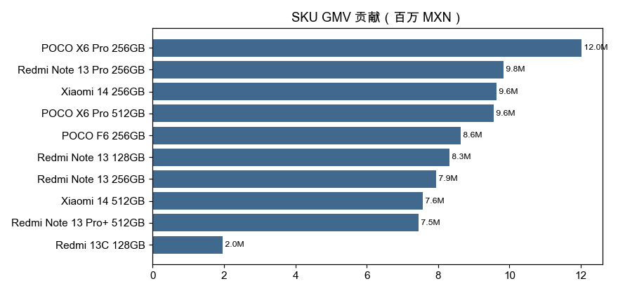
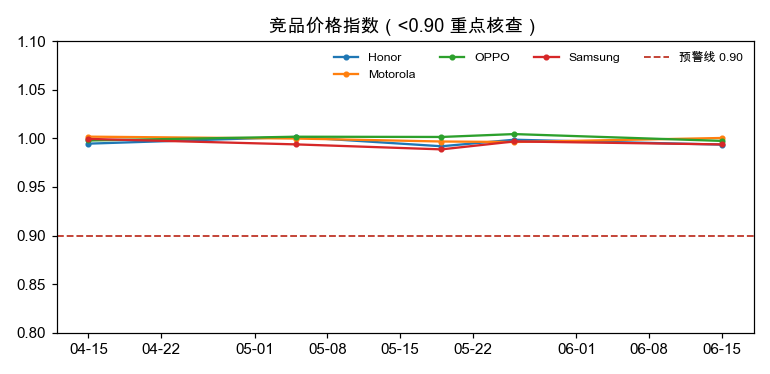
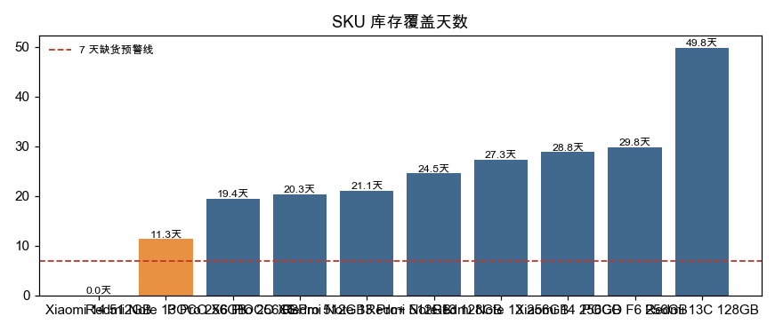

# 墨西哥智能手机跨境运营 · 竞品监控与经营分析

这是我准备跨境运营岗位时做的一个个人项目。业务场景是墨西哥手机跨境零售，覆盖 **Mercado Libre** 和 **Amazon México** 两个平台，把跨境运营的日常工作从头到尾跑了一遍。

## 做了什么

- **日常经营监控**：90 天、10 个 SKU、双平台的日报底表，每天看销量进度、GMV、转化率、ROI、库存覆盖，输出日报周报和异常清单；
- **竞品监控**：8 个竞品型号、6 个卖家、5 次快照，用同型号中位价做参考价算价格指数，低于 0.9 或单次变价超 8% 就预警；
- **活动执行**：一次 7 天大促加一次新品首发，从目标拆解、资源提报、过程追踪做到复盘；
- **问题与费用**：问题台账（owner / 截止时间 / 关闭标准）+ 费用台账（预算 / 执行 / 验收 / 效率）。

## 几个结论

- 90 天总销量 13,120 台，季度目标完成 **92.4%**，落后时间进度 7.6 个百分点，缺口主要出在 Redmi 系列；
- 大促前一天竞品集中降价，三星某卖家价格指数降到 **0.87**，是明显的低价甩卖信号；
- Xiaomi 14 512GB 首发日均销量翻了 **5.75 倍**，但备货没跟上，05-27 起断货；
- 大促 GMV 较基准周 **+69%**，增量 GMV 约 **405 万比索**，增量 ROI **10.5**。

## 文件说明

| 文件 | 内容 |
| --- | --- |
| `项目总结.docx` | 完整项目总结 |
| `经营看板.xlsx` | 一页经营看板（6 张 Excel 原生图表） |
| `竞品价格监控表.xlsx` | 价格指数 + 异常预警 |
| `大促复盘与目标拆解.xlsx` | 目标拆解 + 增量复盘 |
| `日常经营分析表.xlsx` | 日报 / 周报 / KPI / 异常清单 |
| `SQL分析脚本.sql` | 日汇总、SKU 排名、7 日滚动、活动前后对比 |
| `scripts/` | Python 数据生成 / 清洗 / 分析 / 看板 / 日报自动化脚本 |

## 数据说明

内部销量、库存、费用是合成数据（个人拿不到卖家后台的真实数据）；竞品价位参考了公开比价网站的墨西哥参考价。数据口径在项目总结里也写清楚了。

## 看板截图

### 周度经营趋势

### 平台占比与系列贡献
 

### SKU 贡献

### 竞品价格指数与库存覆盖
 
